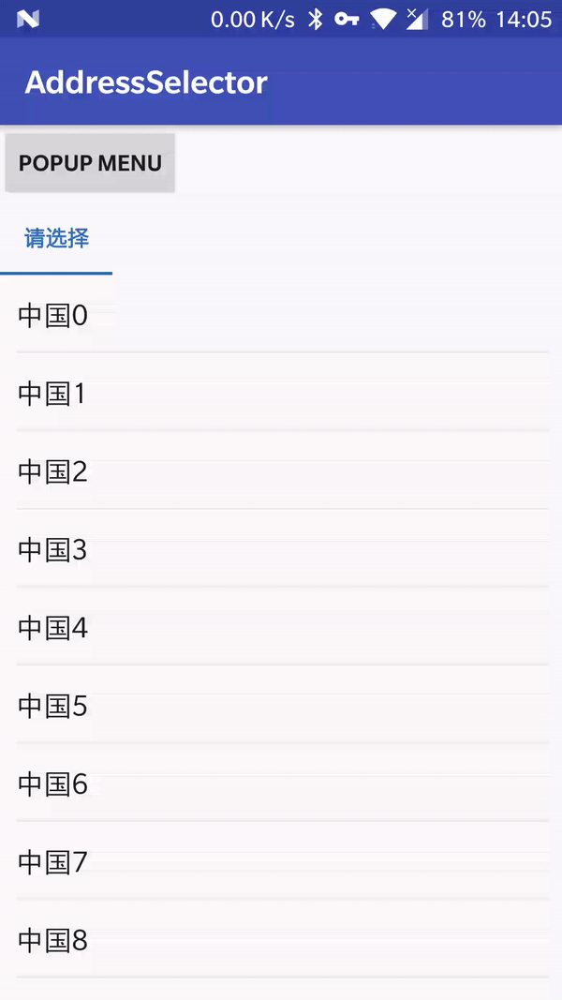
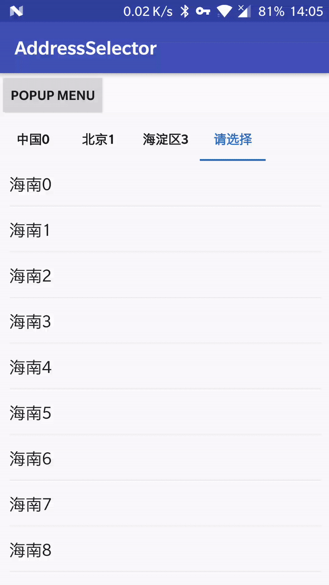

# AddressSelector

## 一、简介
* BouncingMenu + 地址选择器
* 可以展现不同深度，只需要回调对应的函数就可以了。
* 其他仿京东地址选择器都是固定层级的。

## 二、效果
### 1.没有弹窗


### 2.有弹窗


## 三、使用
### 1.创建menu
View参数一般选择按钮的view，点击监听的参数view即可。
String参数是展示路径，可以作为展示历史选择。
```
menu = BouncingMenu.make(view, "中国,北京,海淀区").show();
```

### 2.设置回调
* queryData(TabController tabController, String path)：  
  TabController提供给adapter必要时调用controller的方法。当然，也可以抽取接口面向接口编程。  
  Path提供路径供外部网络获取数据。
* finishSelect(String path, String id)：  
  Path是最终路径，以逗号分割，可以作为历史选择保存起来。  
  Id是叶子节点id，这需要跟后台开发配合了。
```
menu.setOnControlListener(new TabController.OnControlListener() {
    @Override
        public void queryData(TabController tabController, String path) {
            BaseRecyclerAdapter adapter;
            if (TextUtils.isEmpty(path)) {
                adapter = GeoFenceAdapter.newInstance(tabController, "中国", false);
            } else {
                switch (path.split(",").length) {
                    case 1:
                        adapter = GeoFenceAdapter.newInstance(tabController, "北京", false);
                        break;
                    case 2:
                        adapter = GeoFenceAdapter.newInstance(tabController, "海淀区", false);
                        break;
                    default:
                        adapter = GeoFenceAdapter.newInstance(tabController, "海南", true);
                        break;
                }
            }
                
            tabController.setAdapter(adapter);
        }

        @Override
        public void finishSelect(String path, String id) {
            Toast.makeText(MainActivity.this, path, Toast.LENGTH_SHORT).show();
        }
    });
```

### 3.处理onBackPressed事件
* 建议在activity使用menu，因为在Fragment没有onBackPressed方法。
```
@Override
public void onBackPressed() {
    if (menu != null && menu.isAlive()) {
        menu.dismiss();
        return;
    }
    super.onBackPressed();
}
```
